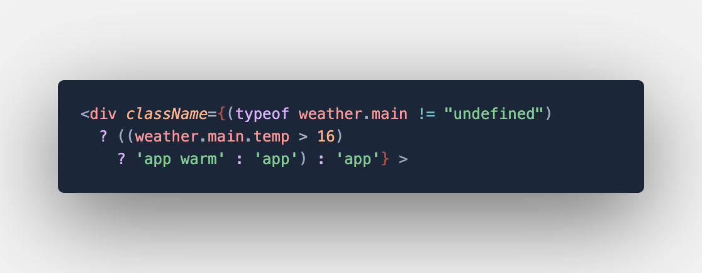
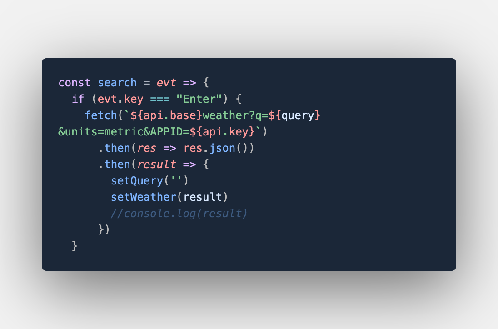

#  World Wide City Weather application

## This responsive application allows for users to search over 200,000 cities on Earth. 

### Languages Used:
- Javascript
- HTML
- CSS

### Additional:
- React library
- Node Modules
- Third party API: https://openweathermap.org/current

### Screenshots of Code:

